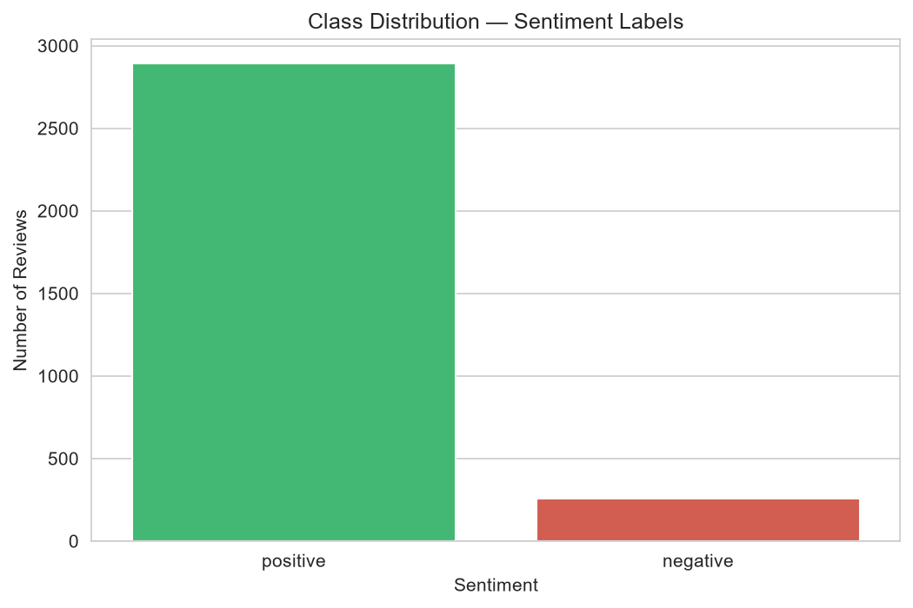
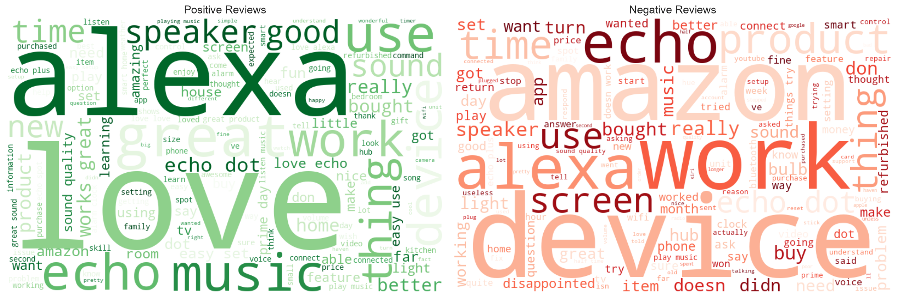
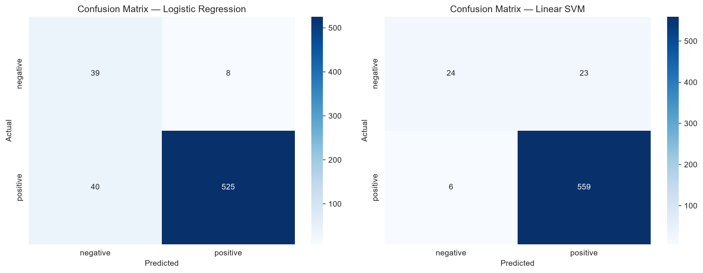
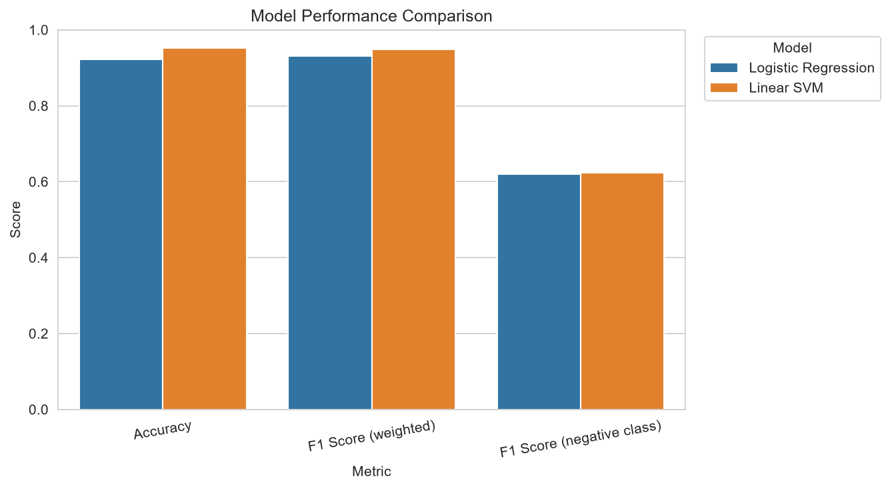

# Week 5 — NLP & Sentiment Analysis Dashboard

**AI/ML Pre-Internship Program — IT Simplera Institute**
**Name:** Komal | **Roll No:** AIMLB01-1730

An end-to-end NLP project that cleans and analyzes real Amazon customer reviews, trains a sentiment classifier, and deploys it in an interactive Streamlit dashboard.

---

## Project Overview

This project applies Natural Language Processing (NLP) to real Amazon customer reviews to predict whether a review expresses **positive** or **negative** sentiment.

**Part 1** builds the ML pipeline in a Jupyter notebook: loading and cleaning review text, visualizing class-specific vocabulary with word clouds, converting text to numerical features with TF-IDF, and training two classification models.

**Part 2** wraps the best-performing model in a Streamlit dashboard where a user can type any review and get an instant sentiment prediction with a confidence score.

Sentiment analysis like this powers real-world tools such as customer feedback triage, product review monitoring, and support ticket routing.

---

## Dataset Information

| Property | Detail |
|---|---|
| Source | Real Amazon customer reviews (Alexa-enabled devices) |
| File | `data/amazon_reviews.csv` |
| Total reviews | 3,150 |
| Review text column | `verified_reviews` |
| Sentiment label column | `feedback` (1 = positive, 0 = negative) |
| Other columns | `rating`, `date`, `variation` (product variant) |
| Missing values | 1 row with a missing review (dropped) |
| Class balance | 91.87% positive / 8.13% negative — **imbalanced** |

The imbalance is important context for the modeling choices below — both models are trained with balanced class weights instead of discarding data.

---

## Repository Structure

```
week5_nlp/
├── notebooks/
│   └── week5_nlp.ipynb          # Full NLP pipeline: cleaning → EDA → vectorization → modeling → evaluation
├── data/
│   └── amazon_reviews.csv       # Dataset used for training
├── model/
│   ├── sentiment_model.pkl      # Saved best model (Linear SVM, calibrated)
│   ├── tfidf_vectorizer.pkl     # Saved fitted TF-IDF vectorizer
│   ├── class_distribution.png
│   ├── wordclouds.png
│   ├── wordcloud_positive.png
│   ├── wordcloud_negative.png
│   ├── confusion_matrices.png
│   └── model_comparison.png
├── screenshots/
│   ├── dashboard_home.png
│   ├── dashboard_data_overview.png
│   └── dashboard_predictor.png
├── app.py                       # Streamlit dashboard (3 pages)
├── requirements.txt
└── README.md
```

---

## Environment Setup

**Requirements:** Python 3.9+, VS Code (recommended)

1. Clone or download this repository and open the folder in VS Code.

2. Create and activate a virtual environment:
   ```bash
   python -m venv venv

   # Windows
   venv\Scripts\activate

   # macOS/Linux
   source venv/bin/activate
   ```

3. Install dependencies:
   ```bash
   pip install -r requirements.txt
   ```

4. **Run the notebook:** open `notebooks/week5_nlp.ipynb` in VS Code, select the `venv` kernel (top-right kernel picker), and Run All. Note the notebook's file paths (`../data/...`, `../model/...`) assume it's being run from inside the `notebooks/` folder — this is the default when opening it directly in VS Code/Jupyter.

5. **Run the dashboard:** from the **project root** (not from inside `notebooks/`):
   ```bash
   streamlit run app.py
   ```
   Streamlit will print a local URL (usually `http://localhost:8501`) — open it in your browser.

---

## Feature Engineering / Text Preprocessing

Raw review text was cleaned before vectorization to remove noise that carries no sentiment signal:

- Lowercase all text
- Strip HTML tags and URLs
- Remove punctuation, digits, and non-alphabetic characters
- Collapse extra whitespace
- Remove stopwords (common words like "the", "is", "and")
- Drop single-character tokens and any review that became empty after cleaning

**Result:** 3,059 of the original 3,150 reviews remained after cleaning.

**Vectorization — TF-IDF:**
TF-IDF (Term Frequency–Inverse Document Frequency) was chosen over a simple word-count vectorizer because it down-weights words that appear across almost every review (generic terms) and up-weights words distinctive to a specific review — which helps a linear classifier separate positive from negative language more cleanly. It's also efficient for this dataset size and pairs well with linear models.

| Parameter | Value |
|---|---|
| `max_features` | 5,000 |
| `ngram_range` | (1, 2) — unigrams + bigrams |
| `min_df` | 2 |
| Output shape | 3,059 × 5,000 |

---

## EDA Findings

- The dataset is **heavily imbalanced**: 2,893 positive reviews vs. only 256 negative reviews (91.87% / 8.13%).

  

- Word clouds of the cleaned text show clearly different vocabulary between the two classes — positive reviews are dominated by words like *love*, *great*, and *easy*, while negative reviews surface words tied to problems and disappointment, like *work*, *disappointed*, and *return*.

  

This imbalance directly informed the modeling decision to use `class_weight="balanced"` in both classifiers rather than dropping majority-class data.

---

## Model Training Process

1. **Split:** 80/20 stratified train/test split (2,447 train / 612 test), preserving class proportions.
2. **Models trained** (both with `class_weight="balanced"` to counter the imbalance):
   - **Logistic Regression** — interpretable linear baseline.
   - **Linear SVM** (wrapped in `CalibratedClassifierCV`) — strong performer on high-dimensional sparse TF-IDF data; calibration adds probability/confidence scores for the dashboard.
3. **Evaluation:** classification report (precision/recall/F1) and a confusion matrix per model.

   

4. **Comparison:** both models compared on accuracy and weighted F1-score; the better one saved along with its vectorizer.

   

---

## Results and Conclusions

| Model | Accuracy | F1 (weighted) | F1 (negative class) |
|---|---|---|---|
| Logistic Regression | 0.9265 | 0.9349 | 0.6457 |
| **Linear SVM** | **0.9526** | **0.9477** | 0.6234 |

**Linear SVM** was selected as the best-performing model based on weighted F1-score and accuracy, and was saved (`model/sentiment_model.pkl`) along with its TF-IDF vectorizer (`model/tfidf_vectorizer.pkl`) for use in the dashboard.

Logistic Regression recalls more actual negative reviews (0.87) but with more false positives; Linear SVM is more precise on the negative class (0.80 precision) but catches fewer of them (0.51 recall) — a typical precision/recall trade-off on imbalanced data. Overall, Linear SVM generalizes better across both classes.

---

## Dashboard — Screenshots

**Home** — project introduction and explanation of sentiment analysis


**Data Overview** — class distribution and word clouds from Part 1


**Sentiment Predictor** — type any review, get a live prediction with confidence score


---

## Tech Stack

`pandas` · `numpy` · `scikit-learn` · `matplotlib` · `seaborn` · `wordcloud` · `streamlit` · `joblib`
